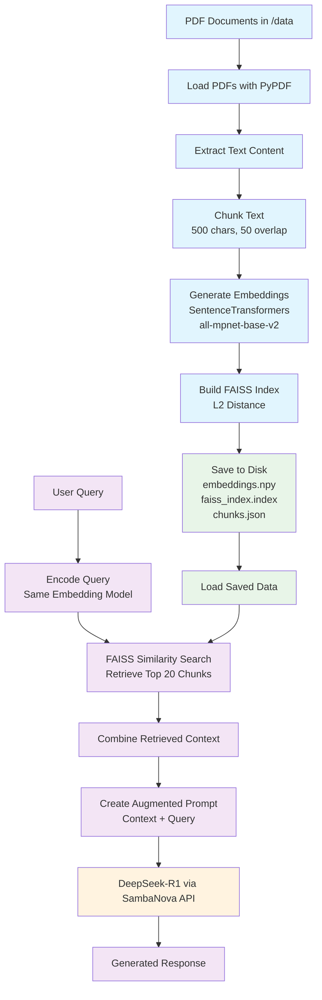
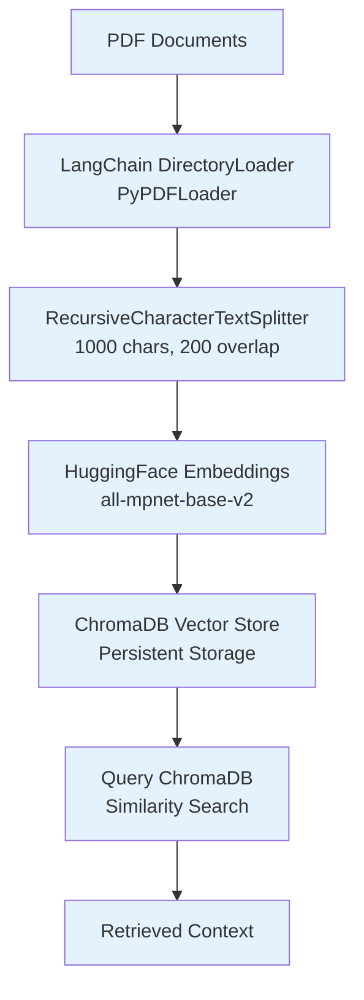
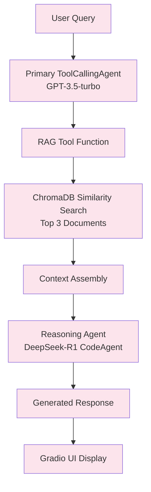
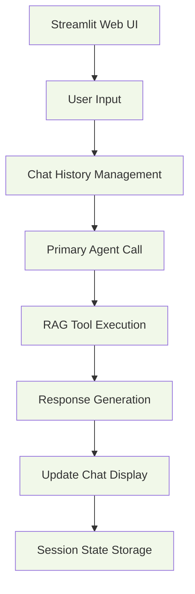
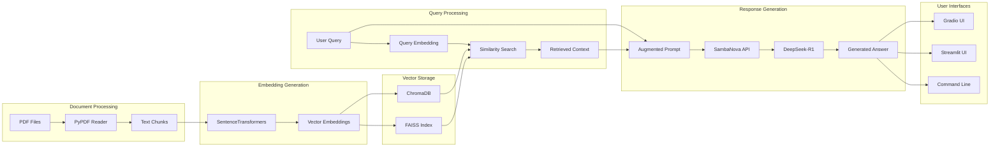

# RAG with DeepSeek-R1 System Flowchart

## Main RAG System Architecture

## Alternative Implementation Flows

### ChromaDB Implementation (src/ingest_pdfs.py)

### Agent-Based RAG (src/r1_smolagent_rag.py)

### Streamlit Web Interface Flow

## Detailed Component Interaction

## Data Flow Summary

### Phase 1: Indexing (Offline)
1. **Input**: PDF documents in `/data` directory
2. **Processing**: Text extraction → Chunking → Embedding generation
3. **Storage**: FAISS index, embeddings array, chunks metadata
4. **Output**: Searchable vector database

### Phase 2: Retrieval (Runtime)
1. **Input**: User natural language query
2. **Processing**: Query embedding → Similarity search → Context retrieval
3. **Augmentation**: Combine context with query in structured prompt
4. **Generation**: DeepSeek-R1 processes augmented prompt
5. **Output**: Contextually relevant answer

## Key Technical Decisions

- **Embedding Model**: `sentence-transformers/all-mpnet-base-v2` for semantic similarity
- **Vector Search**: FAISS with L2 distance for efficiency
- **Chunking Strategy**: Sliding window with overlap to preserve context
- **LLM**: DeepSeek-R1 via SambaNova API for reasoning capabilities
- **Multiple Interfaces**: CLI, Streamlit, and Gradio for different use cases

## Implementation Variants

| Component | Main Implementation | Alternative 1 | Alternative 2 |
|-----------|-------------------|---------------|---------------|
| Vector Store | FAISS | ChromaDB | ChromaDB |
| Document Loading | PyPDF | LangChain | LangChain |
| Text Splitting | Simple sliding window | RecursiveCharacterTextSplitter | RecursiveCharacterTextSplitter |
| Agent Framework | Direct API calls | SmolagentS | SmolagentS |
| UI | Command Line | Streamlit | Gradio |
